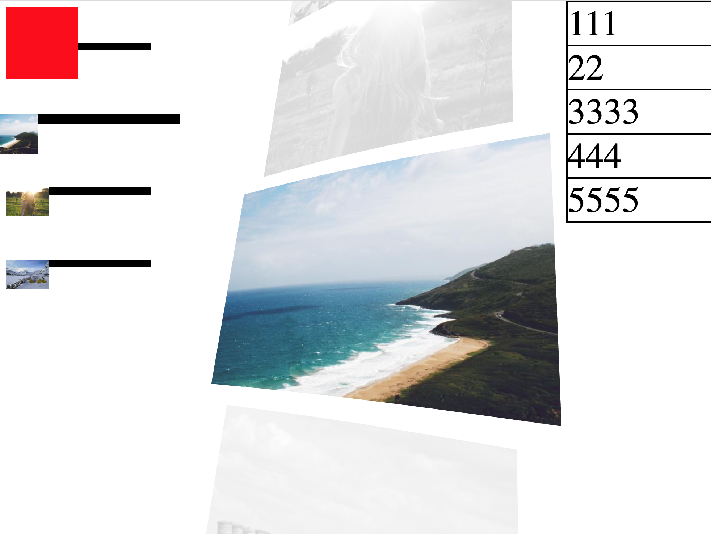

# 3D Scrolling Images With WebGL and Three.js

This is the source code of this wonderful live tutorial:

Youtube Tutorial: <a href="https://www.youtube.com/watch?v=ivg603bYDk8&ab_channel=YuriArtyukh" target="_blank">Scrolling Images With WebGL and Three.js #41</a>

Original Website for inspiration: https://robin-noguier.com/

**IMPORTANT:** This demo was made for studying purposes only and is not ready to be used in production environments.



## About

> Created by:
> Yuri Artyukh

> Transcription by:
> Giovanne Afonso

## Getting Started

Please install parcel to run this project.

```
npm i -g parcel
```

Then clone and start the project:

```
git clone https://github.com/shakegioh/threejs-webgl-scrolling-images.git

cd threejs-webgl-scrolling-images

yarn install

yarn start
```

Now you can see the working demo at:

http://localhost:1234

## Contributing

If you want to improve this demo, feel free to get in touch and/or send a pull request.
